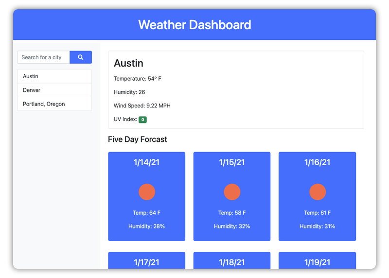

# 006-Weather-Dashboard

[Github Pages](https://rojorevolution.github.io/006-Weather-Dashboard/)

## Project Outline

The goal of this project was to be able to search and display current weather conditions and a five day forcast for various cities through the use of an API. Features include being able to search for cities, having your search history save and appear on the page, and being able to click on your history to rerender the current conditions. 

This project leverages two different API calls from [Open Weather](https://openweathermap.org/). The results returned include:

Current Conditions:
- Current Temperature
- Current Humidty
- Current Wind Speed
- Current UV Index, color coded based on severity

Five Day Focast:
- Date
- Icon based on weather
- Temperature High for the day
- Humidity % for the day